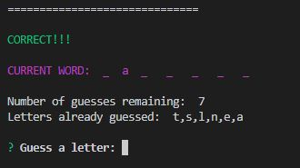

# Word Guess Game Node Application

### Overview

This is a Hawaiian themed word guess game made using node, inquirer npm package, and classes. 

* Words guessed will be displayed on the screen.

* User gets twelve number of tries to guess the word correctly.

* If a letter is already guessed it will not count against your number of tries.

* If you run out of tries or if you guess the word correctly, the game will obtain another word and the game starts again.

View a demo video of the program running [here](https://drive.google.com/open?id=1bL1Iswjnh2NF7CpvlOb5csarwrU8gkS8).

## Steps to run

1. Ensure that you have Node installed on your machine. 
2. Open up a terminal window where this program is installed.
3. Type `npm install` to install all required node modules. 
4. Type `node index.js`
5. The program will display a welcome message along with your current win/loss count, the current word to be guessed, number of guesses remaining, letters that you have already guessed, and prompt you to guess a letter. 

    

6. Enter the single letter you would like to guess and press enter.
7. If the letter guessed was incorrect or correct then a message will be displayed letting you know that it was an incorrect or correct guess and it will re-display the Current Word with any guessed letters displayed, number of guesses remaining, letters that you have already guessed, and prompt you to guess a letter again. 

    

    

8. If you run out of guesses remaining then the program will display a message stating that you have lost, reveals the correct word, and prompts you to play again. 

    

9. If you guess the word correctly before you run out of guesses remaining then the program will display that you have won, displays the correct word and prompts you to play again.

    

10. After selecting if you would like to play again the program will display your current wins and losses. 

    

11. If you select that you would like to play again then the program will also displlay the next word, number of guesses remaining, and prompt you to guess a letter. 

    